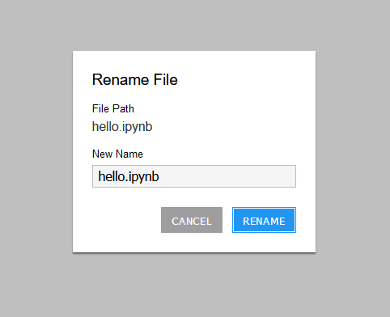

We will begin with JupyterLab. Select the JupyterLab icon in the Anaconda Navigator.  Launching it will cause a tab to open in your Web browser. 
When JupyterLab starts up, you will see a list of your files on the left and three icons to select the mode.  JupyterLab incorporates a Jupyter notebook server as well as a plain Python or iPython console and a simple text editor.  We want to start a Jupyter notebook so click on the top tile.


A browser tab will open with a text entry area.


Your notebook is untitled.  Open the File menu and click Rename.  Name your notebook `first_script.ipynb`, then click the Rename button.



## Cells

The blank line with the blinking cursor is a _cell_.  You can type code into the cell.  After the `In[]` prompt type `print("Hello")`

To run the cell click the arrowhead in the ribbon at the top of the tab, or type the `shift+enter` keys together.

## Your First Program

If you are using Python 2.7 please begin all your programs with the line
`from __future__ import print_function`. The symbols surrounding `future` are double underscores.

Type the following lines into a cell.

```python
Numerals=list(range(1,11))
print(Numerals[3])
print(Numerals[:3])
print(Numerals[3:])
print(Numerals[4:6])
```
Run this cell.  Is the result what you expected?

Now add lines
```python
Numerals.extend(list(range(11,21)))
Numerals[3]=11
del Numerals[4]
print(Numerals)
len(Numerals)
```

### Some Strings

In a new cell type

```python
greeting="Hello World"
hello=greeting[0:5]
greeting2=hello+" there"
output=greeting2+"\n"*2
```

The symbol `\n` stands for "new line."  Run this cell.  In another new cell type
```python
output
```
Run this cell, then in another cell, enter and run the line
```python
print(output)
```

When you are working directly at the interpreter, you can type a variable and it will print the value exactly.  This is called _expression evaluation_.  Using the `print` function observes any formatting.

## Text Editor

JupyterLab includes a simple text editor you can use to create files.  In the upper left of your JupyterLab tab, click `+` to start the launcher. Choose the `text file` tile. Type

```python
def hello():
    print("Hello")
    return None
hello()
```

Be sure to indent lines exactly as shown, and to return completely to the margin for `hello()`. Select your text. From the View menu select Text Editor Syntax Highlighting.  Scroll (far) down to Python and click.  You will now enable syntax coloring for this file.  

Syntax coloring marks different constructs with different font colors. It is very helpful and all modern technical editors provide it for most programming languages.

From the File menu choose Rename Text. Name the file `hello_func.py`.  By default, files will be saved into the folder in which JupyterLab is working. The default is your "User" directory.  After saving the file, return to your Jupyter notebook page and type
```python
import hello_func
```
Then run the cell.

## Exporting your Notebook

### Exporting to a Script

You can export embedded text in your notebook into a script.  First make sure your notebook has a name.  If you have not named your current notebook yet, call it `first_script.ipynb`.  From the Notebook menu find Save and Export Notebook As->Executable Script.  JupyterLab will default to the `Downloads` folder; move it to a location of your choice.  You can make a new directory for your Python scripts if you wish.

### Exporting to Other Formats

If you have installed Anaconda on your local computer, other export options are available to you.  PDF, HTML, and Markdown are popular formats.  These are not all available for Rivanna Open OnDemand users due to the need for certain translation software, but exporting can be done from the command line.  See the [documentation](https://www.rc.virginia.edu/userinfo/howtos/rivanna/convert-jupyter-pdf/) for more information.

## Plotting in JupyterLab

In JupyterLab, open a new notebook with the `+` icon. Type
```python
import matplotlib.pylab as plt
```
Run the cell. In a new cell type
```python
x=plt.arange(-1.,1.1,.1)
y=1./plt.sqrt(x**2+1)
```
Execute the cell.  In the next cell type
```python
plt.plot(x,y)
```

## Resources

Several tutorials are available for Jupyter and JupyterLab online.  One good one is [here](https://www.tutorialspoint.com/jupyter/index.htm).

The official JupyterLab documentation is [here](https://jupyterlab.readthedocs.io/en/stable/index.html)
