Learn how to "prettify" our apps and prepare them for publication!


## Four Approaches to Styling Shiny

1. Accepting the Shiny Defaults

2. Shiny Themes

3. Shiny Dashboards

4. Bootstraplib

## Method 1: Accepting the Shiny Defaults

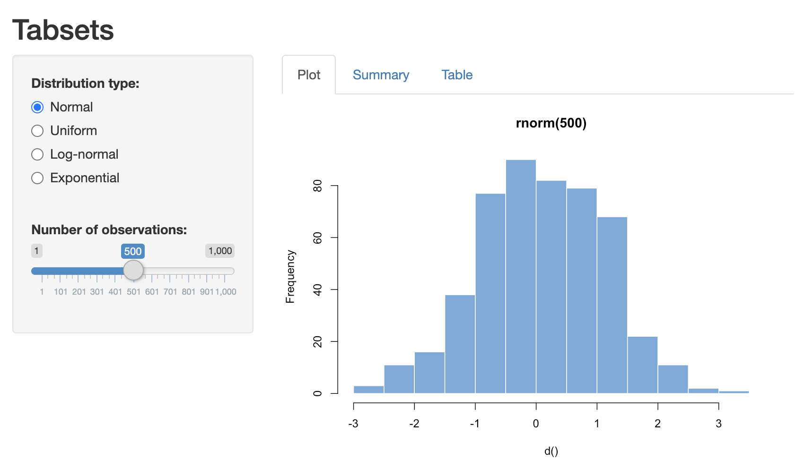

### Built with Bootstrap

- Shiny's default UI uses Bootstrap
- Bootstrap is a CSS framework developed by Twitter
- Easy to customize if you're comfortable with HTML and CSS

### Millions of websites use Bootstrap

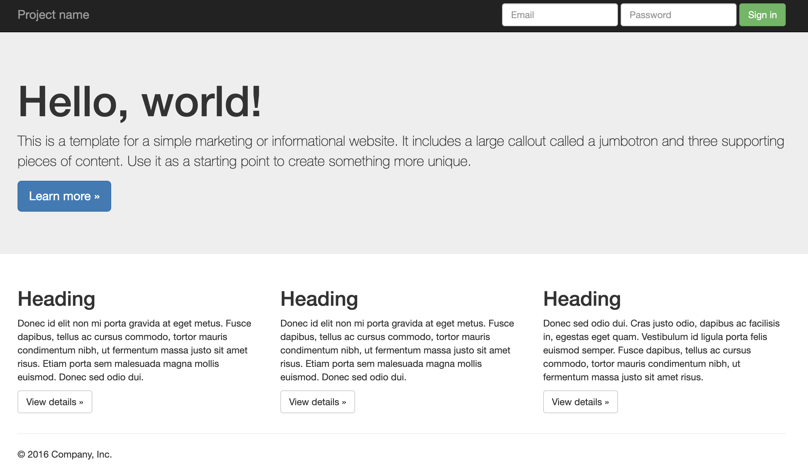
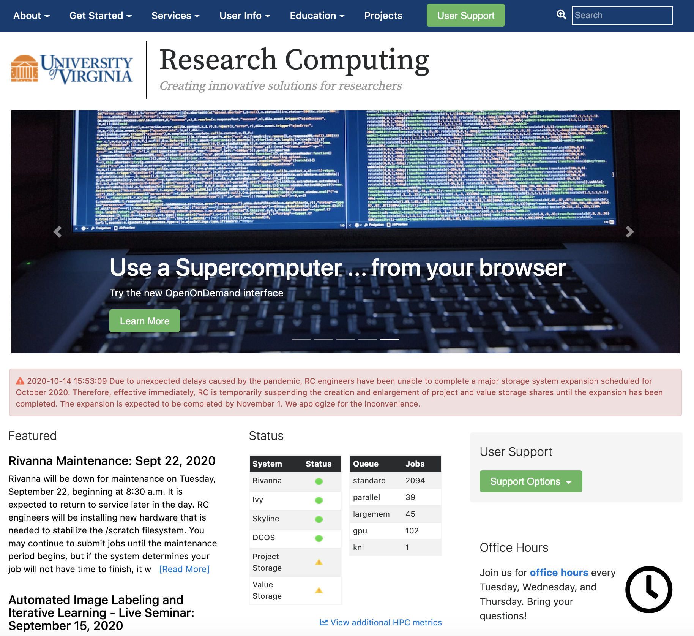

## Method 2: Shiny Themes

The shinythemes package helps you spice up your app

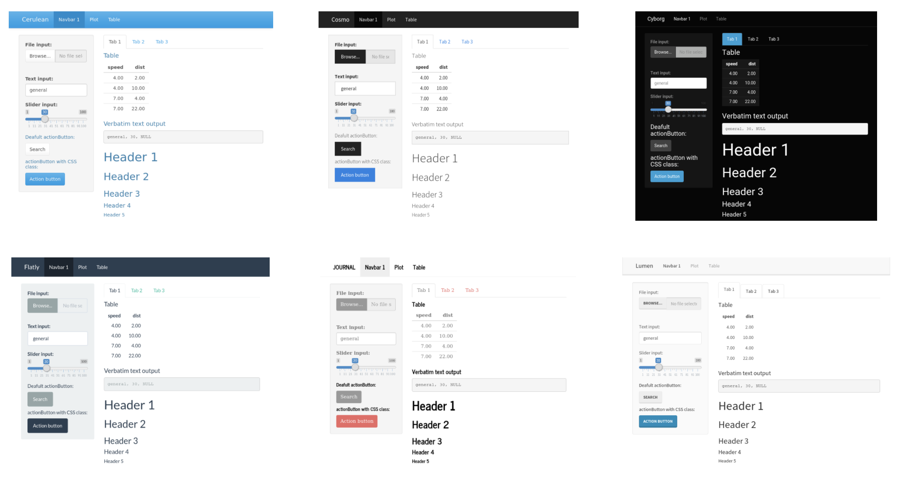

### shinythemes

1. `install.packages("shinythemes")`
2. Add `library(shinythemes)` to `app.R` or `ui.R`
3. Add the `theme` argument to your `fluidPage()`, `navbarPage()`, etc. Set `theme` with `shinytheme("<theme>")`

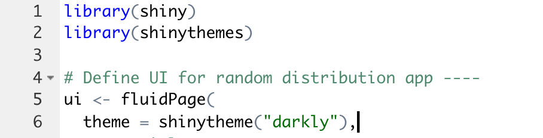

### Bootswatch

All Shiny Themes come from [bootswatch.com](https://bootswatch.com)

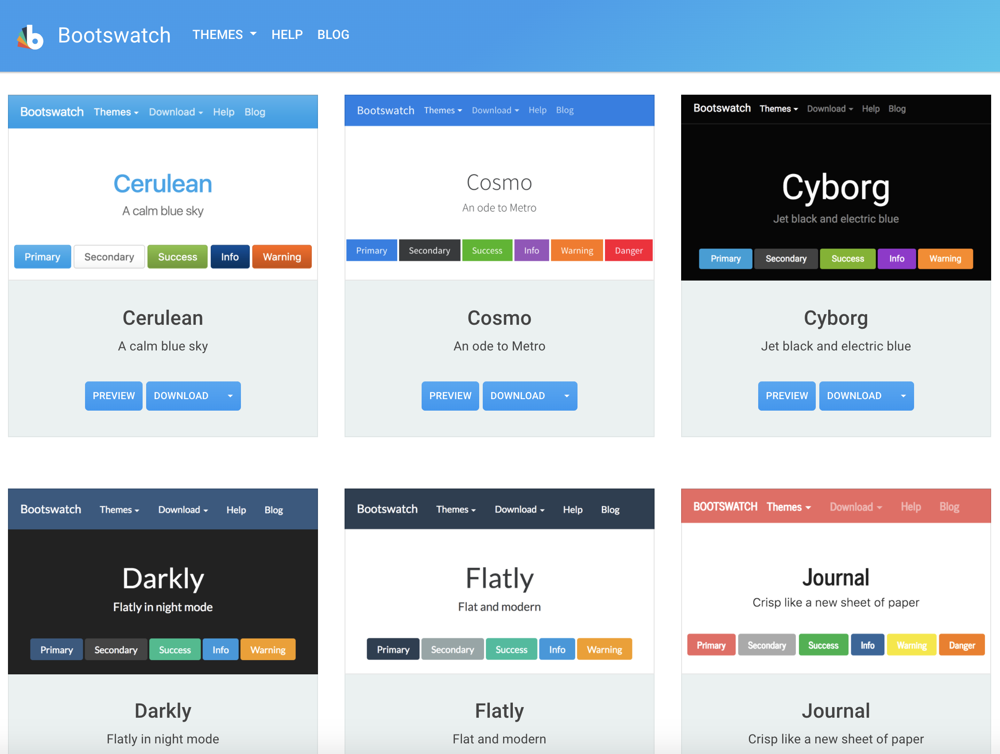

### Using Non-shinythemes Themes

1. Download the CSS files
2. Add .css file to www folder in app directory
3. Set `theme = "myfile.css"`

Try this with the "Quartz" theme!

## Method 3: Shiny Dashboards

Packages like flexdashboard and shinydashboard let you create dashboards for your users

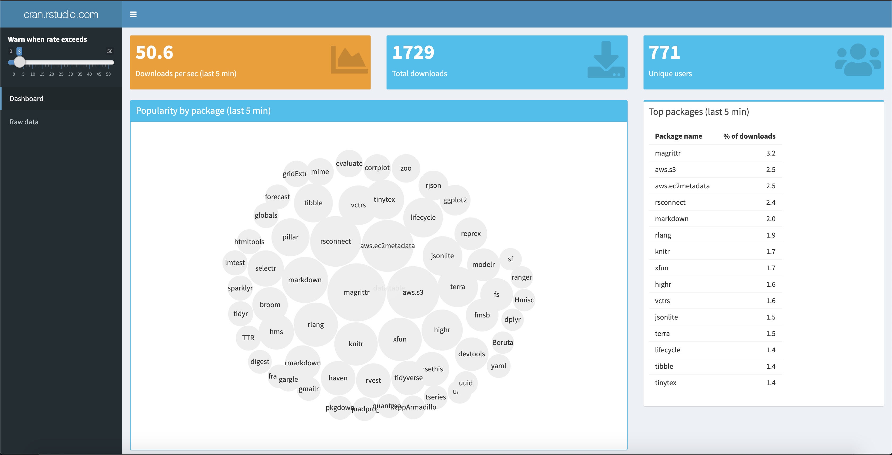

### flexdashboard vs shinydashboard

| **flexdashboard**  | **shinydashboard**    |
|--------------------|-----------------------|
| R Markdown         | Shiny UI code         |
| Super easy         | Not quite as easy     |
| Static or dynamic  | Dynamic               |
| CSS flexbox layout | Bootstrap grid layout |

We'll just touch on shinydashboard here

http://rstudio.github.io/shinydashboard/get_started.html

### Components of a Dashboard

1. Header
2. Sidebar
3. Body

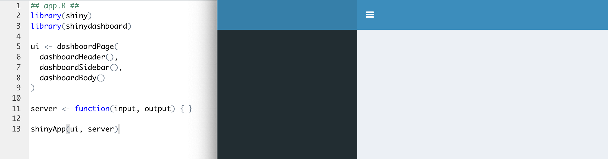

### Boxes

Boxes need to be put in a fluidRow or column

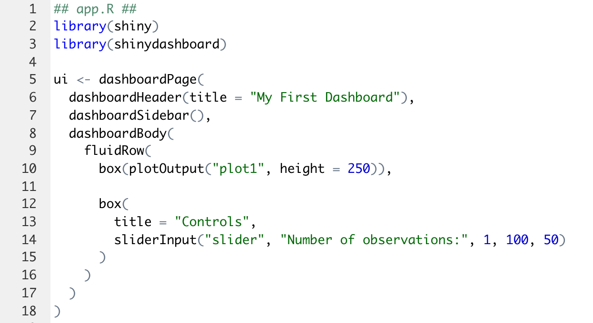
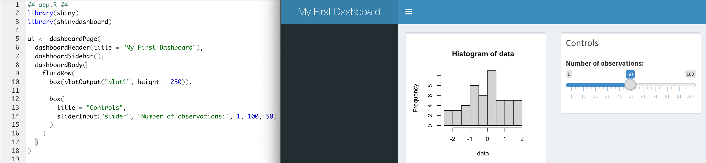

## Add **menu items** to the sidebar

- We'll add `menuItems` that behave like tabs, similar to `tabPanel`
- `menuItems` in the sidebar correspond to `tabItems` in the body

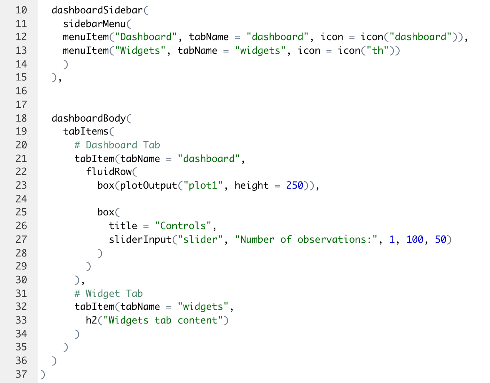
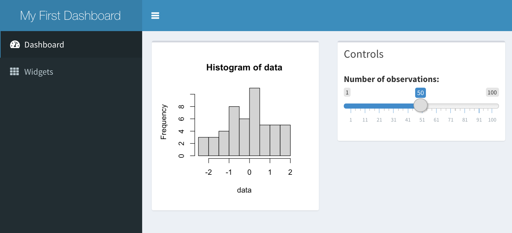

### Change color of dashboard

You can change the color of your dashboard with the `skin` argument (similar to `theme` with `shinythemes`)

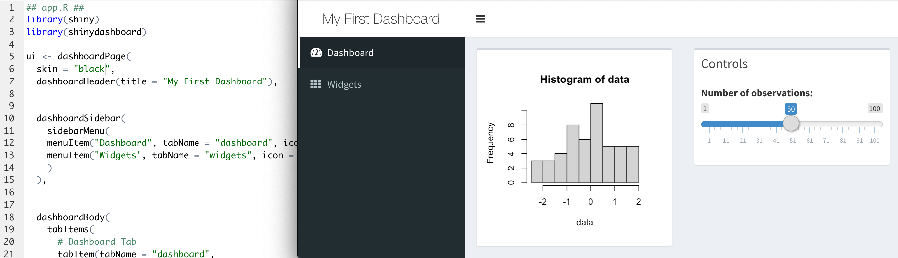

## Method 4: Theming + Branding

### Common Shiny Question

How do I customize my app so the font and colors match my university's?


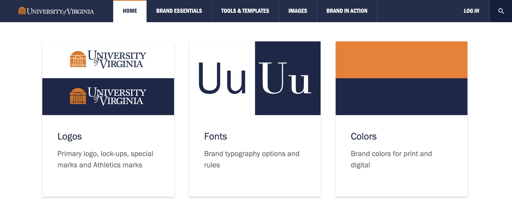

### Sass

### Modifying CSS

- Requires you to know at least some CSS
- Each color value appears in multiple places

### Syntactically Awesome Style Sheets

CSS with Superpowers


Sass allows you to change colors and fonts using variables

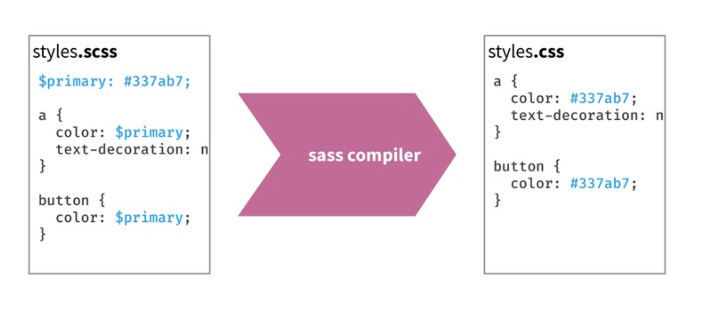

### bslib

Need to install 2 packages (requires shiny>=1.6)
1. **sass**: compile sass to css in R
2. **bslib**: customize Bootstrap in R

https://rstudio.github.io/bslib/

Unfortunately doesn't work with Shiny Dashboards -- use fresh instead!

https://dreamrs.github.io/fresh/articles/vars-shinydashboard.html

### Start with Regular Shiny Code
1. Load bslib
2. Instantiate a `bs_theme` object
3. Set `theme` to your `bs_theme` object in the UI

```
library(shiny)
library(bslib) # step 1

my_theme <- bs_theme() # step 2

ui <- fluidPage(
  theme = my_theme, # step 3
  ...
)
```

### Theming Plots
The `thematic` package enables automatic theming of plots

```
library(thematic)

thematic_on()
onStop(thematic_off)
```

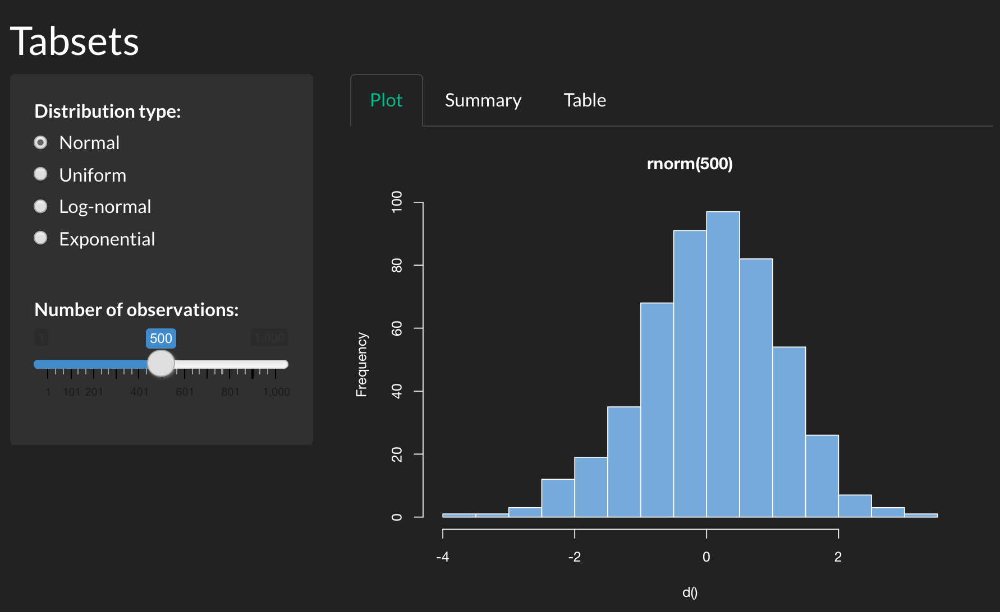

### Preview Your App

1. Add `bs_themer()` to your server function

```
library(shiny)
library(bslib) # step 1

...

server <- function(input, output){
   bs_themer()
   
   ##cool reactive logic##
}
```

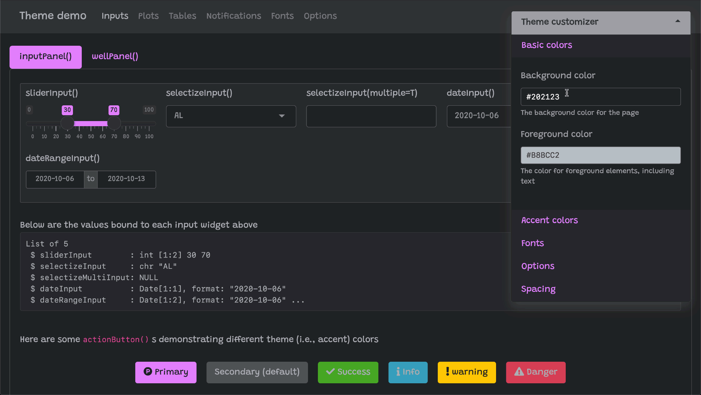

When you make changes in the Preview tool, code for updating your theme is printed to the console. Copy the updates to your Shiny app.

```
my_theme <- bs_theme()

# This line is copied from the console (may need to update theme name)             
my_theme <- bs_theme_update(my_theme, bg = "#4B3E23", fg = "#000000")

```

### How do I find out Bootstrap variable names?

- [List of Bootstrap sass variables](https://rstudio.github.io/bslib/articles/bs4-variables.html)
- [bslib commands](https://rstudio.github.io/bslib/reference/index.html)
