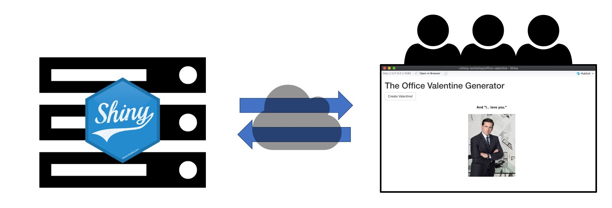
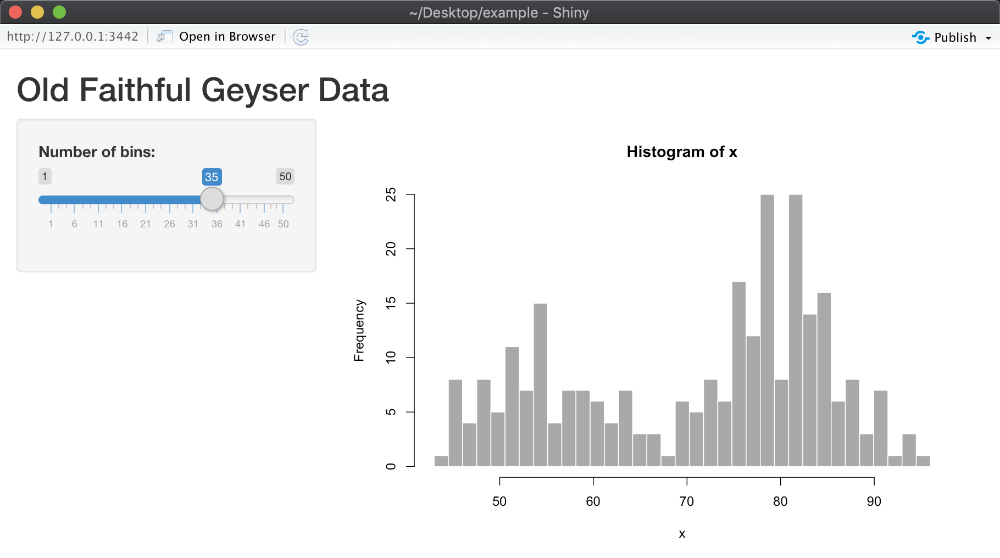
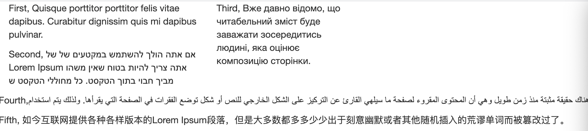
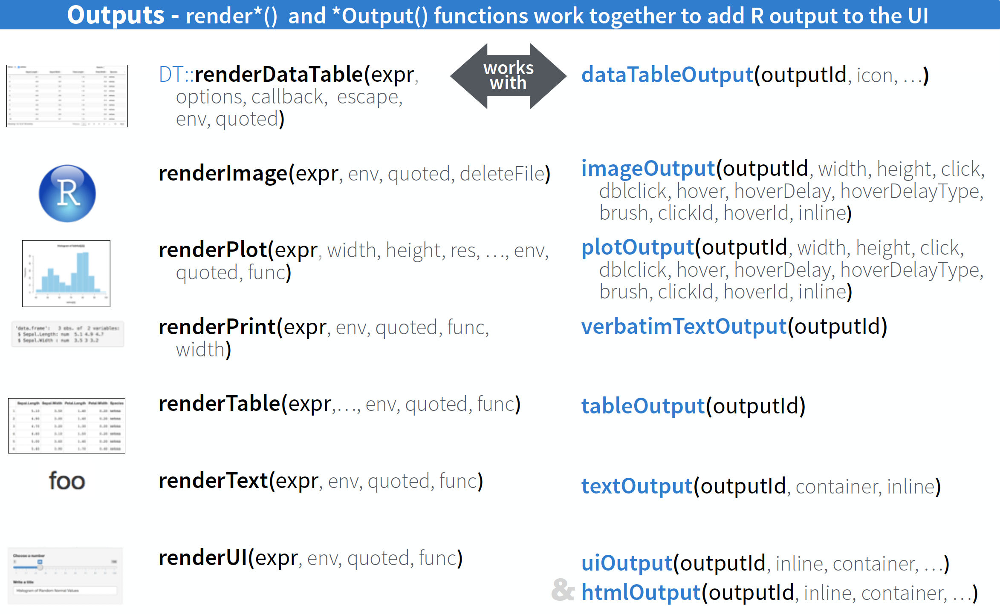
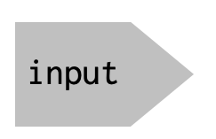
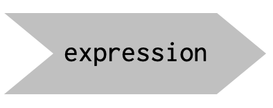
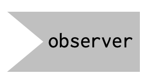
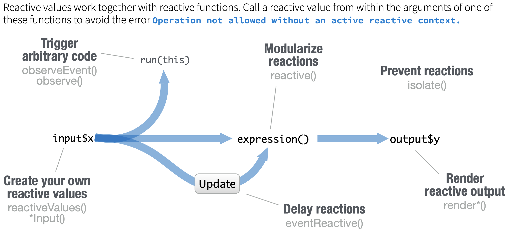

Learn how to create your own web apps in R using Shiny! In this workshop, we will go over Shiny basics and will code an app together from scratch.


# Computer Setup

## What You'll Need

1. **Development** server (just your computer!)
2. **Deployment** server (shinyapps.io, UVA Microservices)

## Development Server

This is where you will write and test the code for your Shiny app. You can interact with your app, but no one else can.


You will spend most of your time on your development server.

### Set Up Your Development Server

**Option 1**: Clone or Download the GitHub Repository

1. Run `git clone https://github.com/uvarc/shiny-workshop` in the terminal
2. -OR- Go to https://github.com/uvarc/shiny-workshop and click green "Code" button, then click "Download ZIP"

**Option 2**: Create a New R Project (need Git installed for this option)

1. **File** > **New Project** > **Version Control** > **Git**
2. Repository URL: https://github.com/uvarc/shiny-workshop
3. **Create Project**

After downloading the code, run `packages-for-workshop.R`

## Deployment Server

Once you're ready to share your app, it's time to move it to a deployment server (i.e. deploy your app).



Once deployed on the deployment server, your development server is no longer serving your app. This means any changes you make locally will need to be pushed to the deployment server before they're visible to the world.

### Set Up Your Deployment Server

Create a free account on shinyapps.io.

Can host 5 apps on shinyapps.io for free.

You can also host your apps on UVA servers:
https://www.rc.virginia.edu/userinfo/microservices/

# Creating a New Shiny App

How do you create a new blank Shiny app?

## Old Faithful

Using **New File** -> **Shiny Web App...** creates a living, breathing Shiny App



## A Better Way to Do It

1. Open a new R script file.
2. Start typing `shinyapp` and press **Tab** to autocomplete. **This will expand into a "snippet" of code--the skeleton of a Shiny App.**
3. Save the file in the `sandbox` folder and run the app.

It's still a working Shiny app--it just doesn't do anything. Starting from the snippet is less error-prone than creating a new project and deleting the guts.

Stop an app by clicking the STOP button in the console.

# What Is a Shiny App?

**Shiny is an R package for developing interactive web applications, or apps.** Shiny apps are just webpages!

Webpages are made up of two main components.

1. **HTML/CSS:** what your app looks like (the **form**)
2. **JavaScript:** what your app does (the **function**)

The difference between Shiny apps and regular webpages: **Shiny apps are powered by an R session.**

## Creating a Shiny app

To create a Shiny app, we need:

1. Regular R stuff: writing code to manipulate and analyze data, visualize with graphs, etc...
2. To create a user interface
3. To connect **1** to **2** with **reactive logic**

# A Metaphor

## Shiny Bridges Two Worlds of R Programming

In Harry Potter, the Knight Bus connected the non-magical, or "Muggle", world to the magical Wizarding World. Similarly, Shiny connects regular R code to the magical world of "reactives" (we will talk more about these later).

| 1. **Muggle World**        | 2. **Wizarding World**                       |
|----------------------------|----------------------------------------------|
| - Regular R code           | - Reactives                                  |
| - Functions, packages, etc | - Functions w/o arguments                    |
|                            | - Values that can't be changed with **`<-`** |
|                            | - Packaged in a `server` function            |

The Wizarding world can reach out to the Muggle world, but not the other way around.

# Project 0: Our First App

## The Main File, app.R

Go to **projects** -> **project0-first-app** and open **app.R**.

- This file contains all the components of the app: the user interface and reactive logic.
- The UI and reactive logic can be written in separate .R files that are sourced in `app.R` or all put in the same file.
- In this case the UI is in `user_interface.R` and the reactive logic is in `reactive_logic.R`.

## shinyApp()

`app.R` is just a regular R script

- Adding the call to `shinyApp()` at the end of the script changes the "Run" button to "Run App"

## Starting in the Muggle World

Let's start with `muggle.R` (our run-of-the-mill R code)

- We load the libraries we need
- We create a function `muggle_plot` that takes variable names from the `diamonds` dataset as inputs and generates a scatterplot
- Test it out if you want by uncommenting and running the last line of the script

## User Interface

Open `user_interface.R`

- The function `tagList` takes HTML functions as inputs and creates a list of HTML components
- Try running the first line, `h2("A very basic Shiny app")` in the console (make sure you have `shiny` loaded)
- Functions like `h2`, `p`, and `actionButton` are wrappers for HTML code (essentially strings)
- The first argument in `actionButton`, `plotOutput`, and `textOutput` are IDs. We will use these IDs in the next part

## Reactive Logic

Open `reactive_logic.R`

- We will connect the UI to the Muggle code with **reactive logic**

- We are assigning a function to `reactive_logic` with three arguments: `input`, `output`, and `session`. The arguments are always the same, but `reactive_logic` is usually called `server`.
- Functions `renderPlot` and `renderText` are assigned to `output$IDname`. They correspond to the UI functions `plotOutput` and `textOutput`

## Invoking the App

`shinyApp(user_interface, reactive_logic)`

To run our app, we use the command `shinyApp`. The first argument is the UI, and the second argument is our reactive logic.


## Deploying the App

1. Put all the files your app needs in a single directory (the name of the directory will be the name of the app)
2. Make sure there is a file called `app.R` with the call to `shinyApp()`
3. Run `rsconnect::deployApp("/path/to/app/directory")`. You may need to connect your shinyapps.io account to deploy an app for the first time.


## Your Turn: Modify the App

Try the following on your own!

1. Hide the button message until the button has been clicked 3 times.
2. Add `selectInput` dropdown menus for the X and Y variables.
3. (Superstar) Connect the `selectInput` menus to the plot (we haven't covered this yet)

# Building a User Interface

There are 3 steps to building a UI:

1. Instantiating input and output widgets
2. Frameworks and layouts
3. Organizing widgets within the framework

# Frameworks and Layouts

- Replace `UI_starting.R` with `UI_fluid_page.R` in the `app.R`.
- Run the app
- Pretty ugly, right? Now try replacing `tagList` with `fluidPage`

## fluidPage()

A fluid page layout consists of rows which in turn contain columns

- Rows ensure that items appear on the same line as long as the browser is wide enough (hence the fluid)
- Columns define how much horizontal space elements should occupy. Horizontal space is defined by a 12-unit wide grid
- Adds some Bootstrap styling (framework for designing websites--developed by Twitter)

## fluidRow() and column()


Changing `tagList` to `fluidPage` didn't do much

Let's add some `fluidRows()` and `column()` functions to create this:



The solution is in `UI_language_soln.R`

## `fluidPage()` is responsive

- Try adjusting the size of your browser window.
- The text adjusts so that it all fits within a single window--no need to scroll left and right!

## Other Layouts

Check out the Shiny cheatsheet to see other types of layouts

https://shiny.rstudio.com/images/shiny-cheatsheet.pdf

- `tabsetPanel()` + `tabPanel()`
- `sidebarLayout()` + `sidebarPanel()`/`mainPanel()`
- `splitLayout()`
- `wellPanel()`
- `navbarPage()`
- `navlistPanel()`

# Widgets

- Go to `projects/project1-ui` and take a look at `UI_starting.R` and `Knight_bus.R`.
- Run `app.R`.
- **Widgets** are the different buttons and fields we see on a webpage.
- We only see the inputs from `UI_starting.R` because nothing is connected to the outputs.

## Input Widgets

### The Shiny Widget Gallery

- You can try out and play with Shiny input widgets on RStudio's website.
- The website shows you how the values change when you modify the input widgets. The site will also show you the code you need to include the widget in your own app.

https://shiny.rstudio.com/gallery/widget-gallery.html

## Output Widgets

- Output widgets are similar to input widgets. However, output widgets require a `render` function to be visible in the app.
- Each output widget has its own corresponding `render` function.



## Playing with Widgets

Add some input widgets to `UI_starting.R`

- actionLink
- checkboxInput
- radioButtons
- textInput

Make sure the app still works with your changes!

## Connecting Inputs to Outputs

Add some reactive logic to `Knight_bus.R` so that the text output `felix` (`output$felix`) displays the selected choice from `annie` (`input$annie`)

# Project: Reactivity

We've already seen some examples with our `render` functions, but what exactly is **reactivity**?

## More Harry Potter Comparisons

Remember, the Knight Bus is our connection between regular R code (Muggle World) and the world of reactives (Wizarding World)

```
knight_bus <- function(input, output, session) {
    reactive code here!
}
```

# Reactives: An Example

```
server <- function(input, output) {
    output$distPlot <- renderPlot({
        hist(rnorm(input$obs))
    })
}
```

In this example, `input$obs` is a reactive source, and `output$distPlot` is a reactive endpoint.

- Clicking or typing into input widgets will set some sort of value, or **reactive source**.
- A **reactive endpoint** is an object that appears in the app, like a plot, text, or values. Reactive endpoints re-execute when their reactive inputs change.

# 3 Types of KB Passengers

| inputs             | conductors             | observers             |
|--------------------|------------------------|-----------------------|
|  |  |  |
| actionButton()     | reactive()             | observe()             |
| selectInput()      | eventReactive()        | observeEvent()        |
| reactiveValues()   | renderText()           | textOutput()          |

- Inputs are reactive sources. Reactive endpoints are called observers because they observe changes to inputs.
- Conductors act like both sources and endpoints. They depend on inputs, but they also provide inputs to other reactives.

# Project 2: Reactives

## Reactives have connections

* Inputs have outward connections
* Observers have inward connections
* Conductors have both inward and outward connections

## Reactive States

***Reactives have 2 kinds of states***

1. **Their value**, e.g. numerical/text value, plot, image
2. **Their validity**--validated, invalidated

- Reactives are invalidated when their inputs change value. They become valid again when they recalculate or re-execute based on their input's new value.

# reactlogShow()

## Project 2: Pythagorean Theorem

This script calculates the hypotenuse of a right triangle using
```
output$C <- renderText({
    sqrt(input$A^2 + input$B^2)
  })
```

- Run `pythagorean-1.R` and change the input values a few times.
- Stop the app
- Run `reactlogShow()` in the console (may need to install first)

A log will open in your browser


## reactlogShow() chart

- Click the forward arrow in the log window
- When `input$A` or `input$B`'s value changed, it became invalidated.
- This then invalidates `output$C`
- `output$C` becomes validated once it recalculates

# Modularizing Reactions

## Adding an expression

This script still calculates the hypotenuse but splits the calculation into two parts

1. `C2 <- reactive(input$A^2 + input$B^2, label = "C2")`
2. `output$C <- renderText(sqrt(C2()))`

- Run `pythagorean-2.R` and change the input values.
- Stop the app
- Run `reactlogShow()`
- Reactives are lazy and only update when they need to

# Reactivity Diagram



# Reactives vs. Observers

**Reactives**: calculate or cache a value, meant to be used as a variable, has a result

**Observers**: for side effects--runs some code when a dependency changes, doesn't yield a result, isn't used as input for other expressions, not assigned to a variable (e.g., updating a menu based on a selection)


> Imagine a delivery man rings your doorbell to deliver a package. You head to the front door to receive it. At the same time, your pet dog starts wildly barking at the door. You open the door and take the package from the delivery man.

In this example:

- The delivery man ringing the doorbell is a reactive input.
- You going to the front door is a conductor.
- Your dog barking is an observer. The dog is reacting to the doorbell ringing, but the barking has nothing to do with package delivery.
- You taking the package is a reactive endpoint (not a side effect).

# Project: Creating a DataFrame

It's time to try coding your own Shiny app. With this app, a user will be able to select a data frame from a list of choices, and then select a response and explanatory variable. The app will have 3 types of functionality:

1. Plot a scatterplot of the data frame (response vs explanatory)
2. Show the head of the data frame
3. Print out a regression report

# Step 1: Reorganize the Code

Start with `app-0.R`. It's a working app-see for yourself!

Even though the app has very little functionality, the script is already crowded.

1. Pull out the UI and put it into a file `ui.R`. Do the same for `server`.
2. Source these into `app-0.R`.
3. Make sure the app still works!

# Step 2: Tabify the app

Having all the outputs on one page can be messy.

1. Put each output widget on its own tab with an informative label
2. Put the input widgets in the same tab as the table display (head of data frame)
3. Make sure the input widget/table display tab is displayed when you start the app

# Step 3: `response` and `explanatory`

Write some reactive logic so that the appropriate choices appear for the `response` and `explanatory` input widgets

Hint: use `updateSelectInput()`. The variable names will be returned by `names(Raw_data())`. Should you use a `eventReactive()` or `observeEvent()` to accomplish this?

# Step 4: Display the data

Write reactive logic to:

1. Display the head of the selected data frame in a table (only the response and explanatory variables)
2. Plot response versus explanatory in a scatterplot

You'll be using the `render` functions to create the displays. Is there a way you can create a common object for that can be used by both of the `render` functions? Hint: use `reactive()`

# Step 5: Show a summary of the model

Display a summary of the linear model `response ~ explanatory`.

Hints:
- You can use `paste()` to construct the formula
- Try `renderPrint`
