# Intro to ACCORD

---

### Overview

ACCORD is a web-accessible secure platform which allows researchers from Virginia public universities to analyze their sensitive data in a central location

---

### ACCORD projects

ACCORD is project-based:
* Investigators can have multiple projects 
  - Example: kidney research and an RNA-seq study
* Projects are isolated, you cannot transfer or access data between them
* Invite co-investigators</li>
  -To add researchers to your project, submit a request here: [Add a researcher](https://www.rc.virginia.edu/form/accord/)

---

### Storage on ACCORD

ACCORD projects come with:
* Home directory of 50GB
* Project directory of 1TB
* Additional storage can be purchased. Please submit a request [here](https://www.rc.virginia.edu/form/accord/)

 

---

### Data on ACCORD

ACCORD supports:
* De-identified PII
* >FERPA
* Business Confidential
* Other types of sensitive data

ACCORD **does not** support:
* Identifiable HIPAA
* CUI
* FISMA
* PCI

Questions about whether your data is suitable for ACCORD? Submit a support ticket [here](https://www.rc.virginia.edu/form/accord/)

---

### Data retention

- Data is stored on the system for 6 months.
- To extend your project, please fill out a [request](https://www.rc.virginia.edu/form/accord/)

---

### Globus data transfer
 
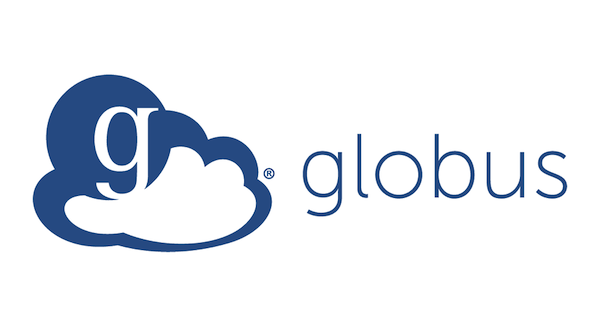

- Data transfer is processed through Research Computing staff for the time being.
- Please fill out a request [here](https://www.rc.virginia.edu/form/accord/) for data transfer

---

### Requirements to access ACCORD

- To access ACCORD, you need:
	- A modern web browser such as Chrome, Firefox, Safari, or Edge
	- You must be logged into your institution’s VPN
		- If you have a sponsored account or are a UVA researcher, you will need the HSVPN
	- Install and register OPSWAT, a posture-checking client

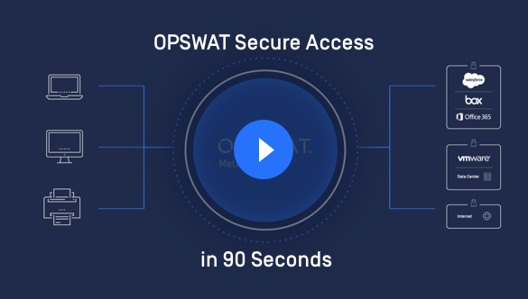

---

### ACCORD Portal

  * ACCORD can be accessed via:[https://accord.uvarc.io/](https://accord.uvarc.io/)
  * The ACCORD website has a User Guide, FAQ, and additional documentation:[https://www.rc.virginia.edu/userinfo/accord/overview/](https://www.rc.virginia.edu/userinfo/accord/overview)

---

### Logging into ACCORD

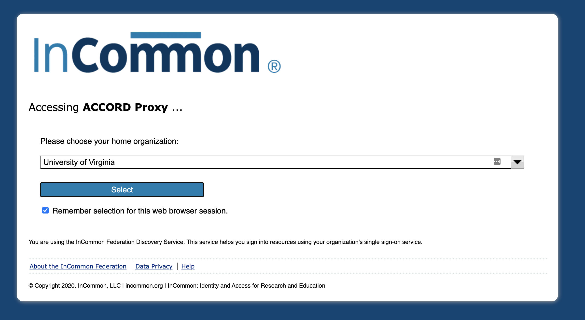

* To access ACCORD, you need to log in through InCommon
* Select your home institution from the dropdown menu (or UVA if you have a sponsored account)

---

### Logging into ACCORD

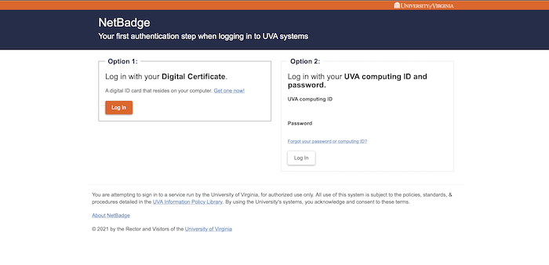

Log in using your home institution’s credentials
* In this example, UVA will ask you to login using NetBadge. If you're from another institution, this will be different

---

### ACCORD dashboard

  * Once you log in, you will see the ACCORD dashboard
  * Your name will appear in the top right corner, along with any recent or currently running sessions

---

### Start a new session

  * A session is an individual instance running one of the available containers (RStudio, JupyterLab, etc.)
  * To create a new session, click on the "*Start A New Session*" button in the top right

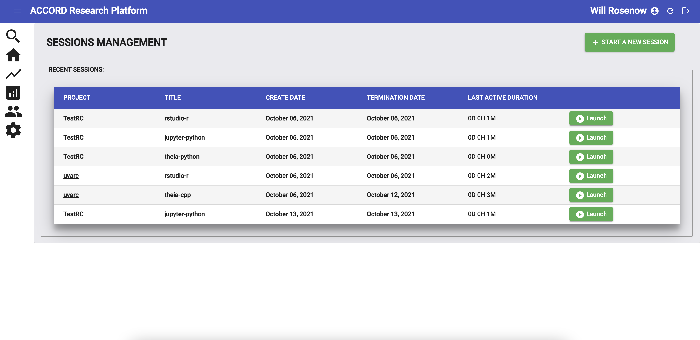

---

### Select a project

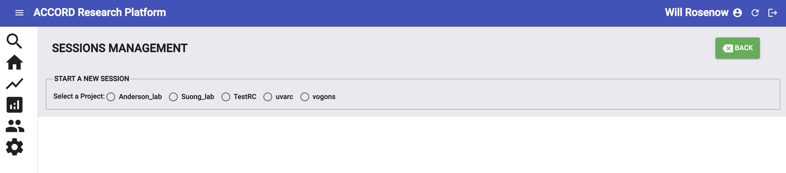

  * To create a new session, you need to select a project
  * Projects are isolated. You can only access data you’ve uploaded to the project you’ve selected

---

### Select an environment

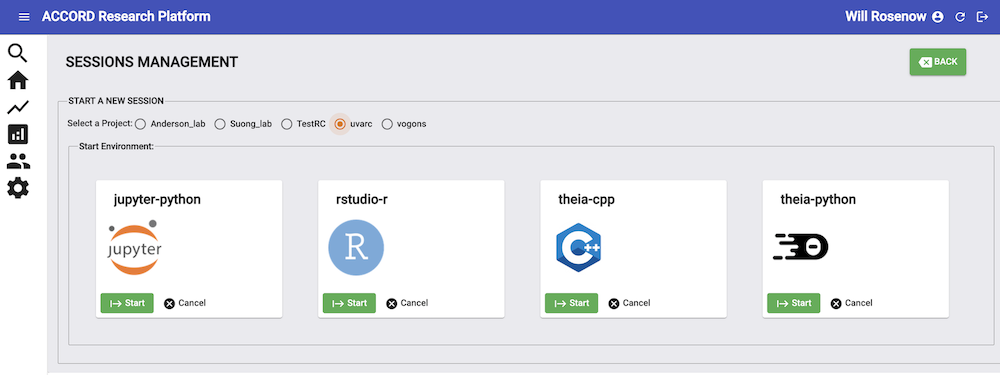

  * After selecting a project, select the environment you want to use
  * To start your new environment, click on the “*Start*” button

---

### Connecting to a session

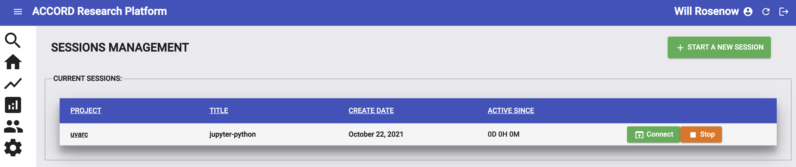

  * Your new session will be in the “*Current Sessions*” section
  * __Note:__ Your session may show pending as the system waits for resources to become available
  * Once your session is ready, click the “*Connect*” button to launch your session

---

### Stopping a session

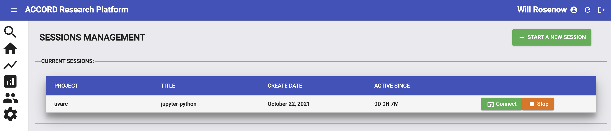

  * When you’re finished working in a session, __always__ click on the “**Stop**” button to delete it. This will free up resources for the system
  * Failing to delete sessions will slow down the system and create long wait times for researchers

---

### Recent sessions

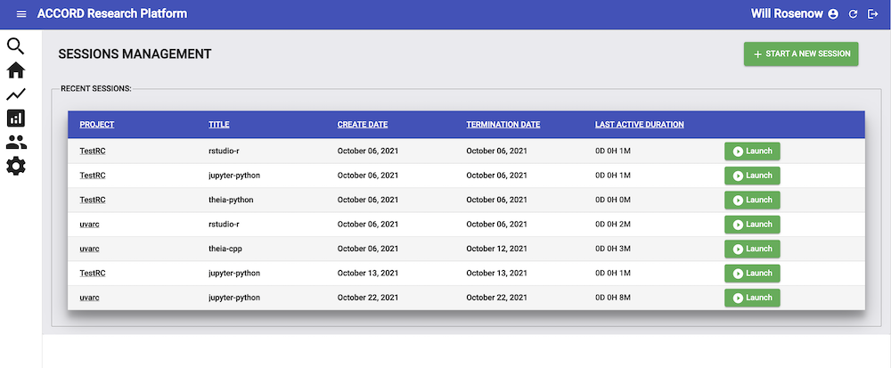

  * After stopping a session, it will be moved to the “*Recent Sessions*” section
  * You can re-launch any session by clicking the “*Launch*” button

---

### Want to learn more?

* The ACCORD website has additional documentation, FAQs, and a user guide:
  * [https://www.rc.virginia.edu/userinfo/accord/overview/](https://www.rc.virginia.edu/userinfo/accord/overview/)
* Have issues or questions? Fill out a support ticket [here](https://www.rc.virginia.edu/form/accord/)

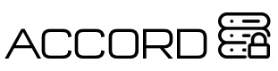
