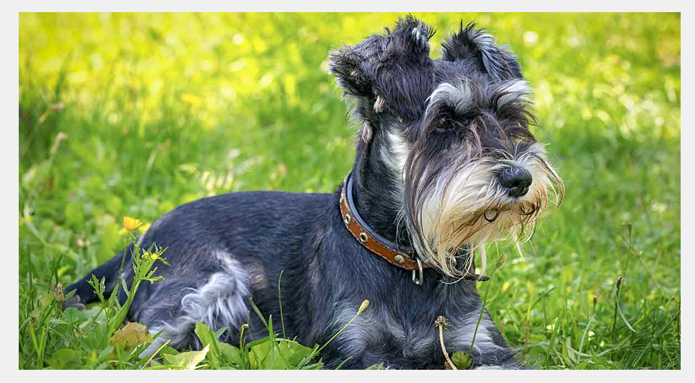
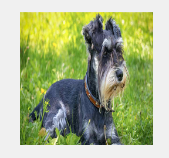
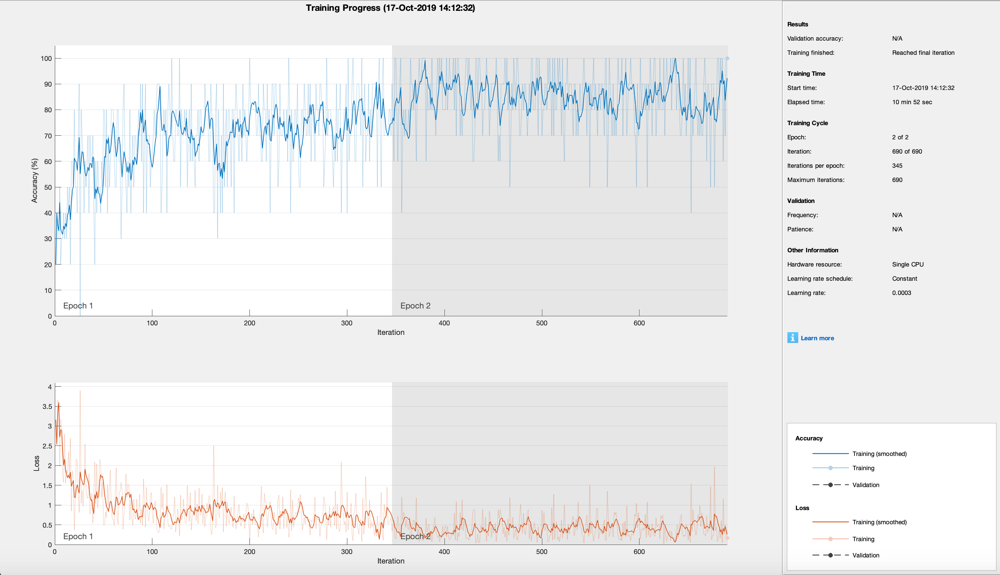
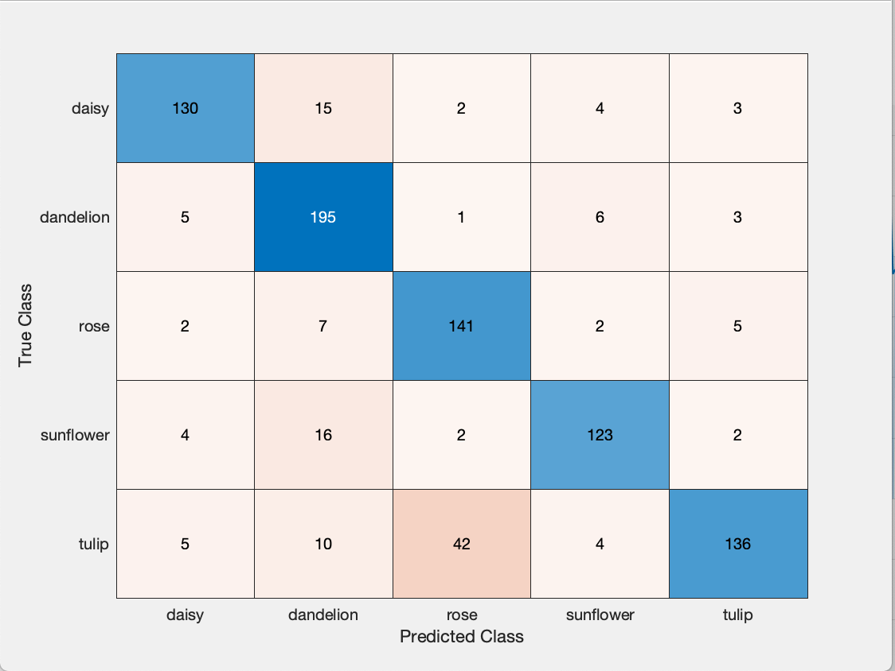
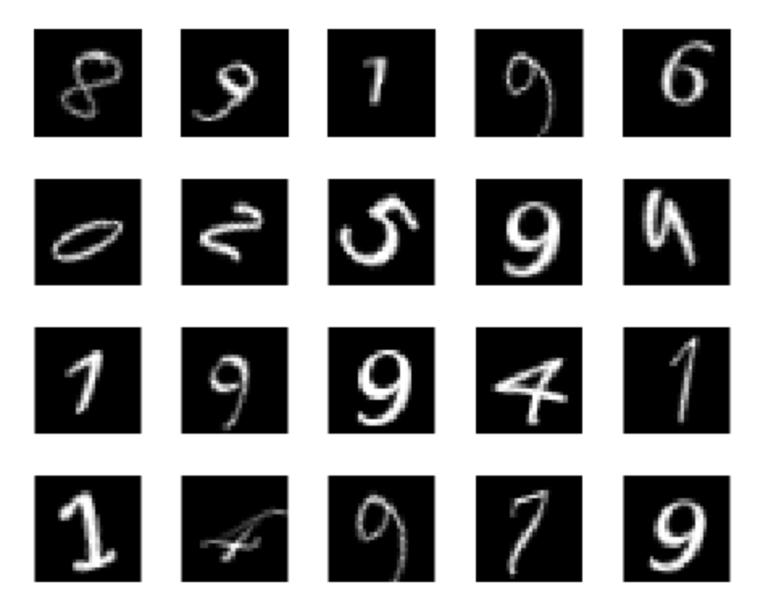

If you are using MATLAB on your desktop computer, make sure you have the **Deep Learning Toolbox** and
**Deep Learning Toolbox Model for AlexNet Network** installed. You can go to the **Add-On Explorer** to install
these packages.

# Using the Sample Dataset

To use the images in the sample dataset, first unzip the folder and add the folder and
subfolders to your path. This will make the files visible to MATLAB.

You can then change directory into the `DeepLearning` folder. This is where we will be working
for the remainder of this tutorial.

```matlab
unzip('DeepLearning.zip')
addpath(genpath('DeepLearning'))

cd DeepLearning
```


# Example 1. Using a Pretrained Network

## AlexNet

AlexNet is a neural network that was developed by Alex Krizhevsky at the University of Toronto
in 2012. AlexNet was trained for a week on one million images from 1000 different categories.

In this example we will load AlexNet into MATLAB and use it to classify some images.

### 1. Load AlexNet

Load the pretrained network AlexNet into your MATLAB workspace as a variable `net`.

```matlab
net = alexnet;
```


### 2. Load the image

Load the first sample image into the workspace as a variable `img`.

```matlab
img = imread('file1.jpg');
```
Optionally, you can also view the image.

```matlab
imshow(img)
```



### 3. Resize the image

AlexNet was trained on images that are 227 x 227 pixels in size. This means any images we want
to classify with AlexNet must also be this size.

```matlab
% See the size of the image

imgSize = size(img)


% Resize the image

img = imresize('img', [227 227]);
imshow(img)
```


### 4. Classify the image

The `classify` function takes a neural net and an image as inputs and returns a categorical prediction
as an output.


```matlab
pred = classify(net, img);
```

Try classifying the other images in the `SampleImages` folder. What results do you get?


# Example 2. Perform Transfer Learning


## Transfer Learning

Transfer Learning is the process of modifying a pretrained neural network to

## Datastores

Datastores are repositories for collections of data that are too large to fit in memory.
Instead of storing all the pixel data in memory, datastores allow us to store just the
filepaths and to read the image data into memory as needed.

### 1. Create an image datastore

Create an image datastore. We can label these images based on the folders in which they are organized.


```matlab
imds = imageDatastore('flowers', 'IncludeSubfolders', true, 'LabelSource', 'foldernames');
```

We can preview the first image in our datastore `imds`.

```matlab
imshow(preview(imds))
```


We can also inspect the labels of our images by extracting the `Labels`.

```matlab
imds.Labels
```

### 2. Split the data

When training on new data, we generally want to reserve some of the data for testing. These
data will not be used in training so that we don't overfit the network -- that is, so that the
network isn't just good at classifying images it's already seen before. The test images will be
used to evaluate the network's performance.

Typically we want to split our dataset into two subsets: train and test. Usually we use 80%
of the data for training and use the remaining 20% for testing.

The `splitEachLabel` function allows us to divide the data proportionally within each folder/label.
By default, `splitEachLabel` will split the images based on alphabetical order, so we can use
the `'randomized'` option to randomly assign images to the training and test sets.

```matlab
[train, test] = splitEachLabel(imds, 0.8, 'randomized');
```

### 3. Modify layers of AlexNet

AlexNet is made of 25 distinct layers. We can inspect these layers by looking at the `Layers`
attribute of `net` (the variable in which we loaded AlexNet).

```matlab
layers = net.Layers
```

**Layer 1** is the input layer, which is where we feed our images.

**Layers 2-22** are mostly Convolution, Rectified Linear Unit (ReLU), and Max Pooling layers. This is where
feature extraction occurs.

**Layer 23** is a Fully Connected Layer containing 1000 neurons. This maps the extracted features to each
of the 1000 output classes.

**Layer 24** is a Softmax Layer. This is where a probability is assigned to the input image for each output class.

**Layer 25** returns the most likely output class of the input image.

When starting with a pretrained network, we typically want to modify just the last few layers to suit our
particular problem. The feature extraction layers will adjust themselves based on the images we are training on --
no need to modify them ourselves!


First, we want to create a new Fully Connected layer `fc` with 5 neurons -- one for each of our flower labels.
We will then replace the Fully Connected layer in `layers` with `fc`.

```matlab
fc = fullyConnectedLayer(5);
layers(23) = fc;
```

We also want to replace the last layer with a new classification layer.

```matlab
layers(end) = classificationLayer;
```

### 4. Set the training options

Now we want to train the network with our training data and new layers. Before we begin
training, we want to set our training options, or hyperparameters.

More documentation about the different options can be found [here](https://www.mathworks.com/help/deeplearning/ref/trainingoptions.html).

| Training Option      | Description                                                                                                                                                                                                                                                                                                 |
|----------------------|-------------------------------------------------------------------------------------------------------------------------------------------------------------------------------------------------------------------------------------------------------------------------------------------------------------|
| **Solver Name**      | The solver for the training network. MATLAB allows us to use different optimizers: <br> **Stochastic Gradient Descent with Momentum** `sdgm`, **RMSProp** `rmsprop`, and **Adam** `adam`.                                                                                                                   |
| **MiniBatchSize**    | Size of the mini-batch used for each training iteration. Rather than train the network on the whole <br> training set for each iteration, we can train on mini-batches, or subsets of the data.                                                                                                             |
| **MaxEpochs**        | Number of times the training algorithm passes over the entire training set.                                                                                                                                                                                                                                 |
| **Shuffle**          | Optional shuffling of the training data. Shuffling the training data allows you to train over different mini-batches for each epoch.                                                                                                                                                                        | 
| **InitialLearnRate** | This controls how we quickly the network adapts. Larger learning rates mean the network makes <br> bigger adjustments after each iteration. A rate that is too large can cause the network to converge <br> at a suboptimal solution, while a rate that is too small can make the network learn too slowly. |
| **Verbose**          | Set to `true` if you want progress printed to the Command Window.                                                                                                                                                                                                                                           |
| **Plots**            | Display training progress plots with the `training-progress` option.                                                                                                                                                                                                                                        |

<br>

We can set our desired training options in a variable called `options` using the `trainingOptions` function.

```matlab
options = trainingOptions('sgdm', ...
   'MiniBatchSize', 10, ...
   'MaxEpochs', 2, ...
   'InitialLearnRate', 3e-4, ...
   'Shuffle', 'every-epoch', ...
   'Verbose', false, ...
   'Plots', 'training-progress');

```

### 5. Train the network

Now that we have our options set we can begin training the network on our new dataset. We
will call our new neural network `flwrnet`.

We will use the `trainNetwork` function to train the network. As inputs, we will use our training dataset `train`, our modified layers `layers`, and our training options `options`.

```matlab
flwrnet = trainNetwork(train, layers, options);
```

It will take several minutes to train the network.



### 6. Evaluating performance

After training has completed, we can evaluate the performance of the network `flwrnet` using the reserved
test dataset `test`.

```matlab
% Classify our test dataset

preds = classify(flwrnet, test);

% Extract the actual labels of the test dataset

actual = test.Labels;

% Count the number of predictions that match the actual label

numCorrect = nnz(preds == actual);

% Determine the fraction of correct predictions

fracCorrect = numCorrect/length(actual)
```

We can also create a **Confusion Matrix Chart**, which shows us the number of correct predictions for each output class. The confusion matrix also shows us the breakdown of how incorrect predictions were classified.

```matlab
confusionchart(actual,preds)
```



### 7. Improving Performance

With our initial training options, our resulting network has so-so performance. We can try improving the performance by adjusting the training options.

**MaxEpochs**: We can increase the number of epochs over which we train the network. Generally, the longer we train the dataset, the more performance improves.

**InitialLearnRate**: If we set our initial learning rate too high, we can cause the network to converge at a suboptimal solution. To improve performance, you can try dividing your initial learn rate by 10 and retrain the network.

**MiniBatchSize**: You can try adjusting the mini-batch size. Smaller values typically mean faster convergence but more noise in the training process. Larger batch sizes mean more training time but generally less noise.

There are other training options that you can try adjusting that are dependent on the solver you chose. These options can be explored in the [MATLAB documentation](https://www.mathworks.com/help/deeplearning/ref/trainingoptions.html).


You can also improve performance by testing your network as you are training it; this process is called **validation**. In addition to
setting aside some data for testing after training is complete, we also set aside a validation set. Every few iterations of training, we will classify the images of our validation set and assess the accuracy of the network. This allows us to see how prediction accuracy improves not only on our training data, but also on data the network hasn't seen before. The validation data isn't used to modify any of our network layers--it's just a check to see how training is coming along.


# Example 3. Build a neural network

In some cases it may make more sense to train a network from scratch. This is particularly true if your dataset is very different from those that were used to train other networks.

In this example we will train a neural network to classify images of numerical digits. This uses images built into the MATLAB Deep Learning Toolbox.



### 1. Create an image datastore

First we will create a datastore containing our images.

```matlab
% Retrieve the path to the demo dataset

digitDatasetPath = fullfile(matlabroot, 'toolbox','nnet','nndemos','nndatasets','DigitDataset');


% Create image datastore

imds = imageDatastore(digitDatasetPath, 'IncludeSubfolders', true, 'LabelSource', 'foldernames');
```

### 2. Split the data into training and test datasets

```matlabn
[train, test] = splitEachLabel(imds, 0.8, 'randomized');
```

### 3. Define the layers of your network (the network architecture).

```matlab
layers = [...
    imageInputLayer([28 28 1])
    convolution2dLayer(5,20)
    reluLayer
    maxPooling2dLayer(2,'Stride',2)
    fullyConnectedLayer(10)
    softmaxLayer
    classificationLayer];
```

### 4. Set your training options.

```matlab
options = trainingOptions('sgdm', ...
    'MaxEpochs', 20, ...
    'InitialLearnRate', 1e-4, ...
    'Verbose', false, ...
    'Plots', 'training-progress');
```

### 5. Train the network

```matlab
net = trainNetwork(train, layers, options);
```

### 6. Evaluate performance

```matlab
preds = classify(net, test);

actual = test.Labels;

numCorrect = nnz(preds == actual);

fracCorrect = numCorrect/length(actual);

confusionchart(actual, preds)
```
