OMERO is image management software that allows you to organize, view, annotate, analyze, and share your data from a single centralized repository. 

"This hands-on tutorial will show you how to import images into the OMERO database, organize and tag images, and how to use OMERO with third-party software such as Fiji/ImageJ, MATLAB&trade;, and Python."

Download the sample dataset and scripts so you can follow along with the
examples.

# Import Images

Images can be imported into OMERO individually or in batches. You can import images
through the OMERO.insight desktop client, or through the command line with OMERO.cli tools.

## Using OMERO.insight

1. Click the Importer tool icon in the top toolbar. This will open the OMERO Importer tool.

    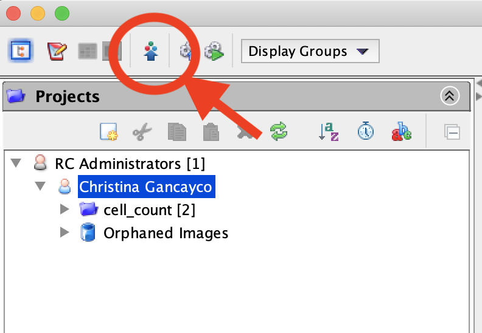

2. In the left window pane of the Importer tool, navigate to the directory containing the images or folders of images
   that you want to import to the OMERO database.

    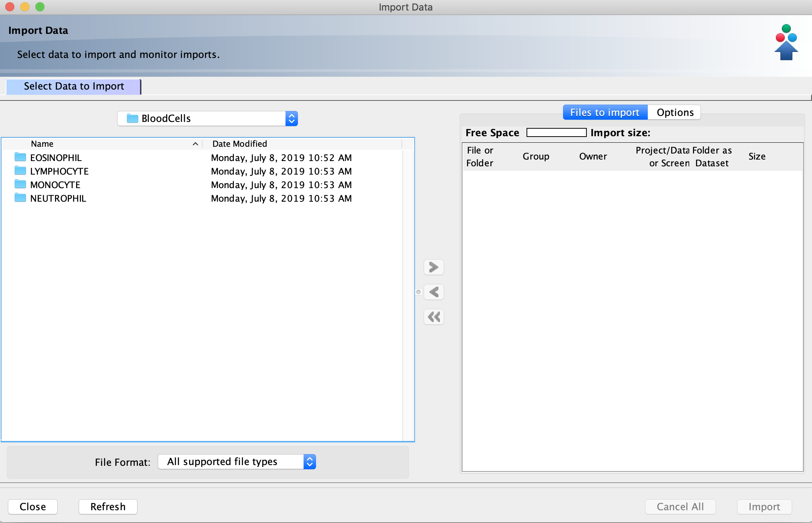

3. Click on the files or folders containing the images you want to import. To select
   multiple items, hold down the Ctrl (Windows) or Command (Mac) key while clicking. Once you
   are finished making your selections, click the ">" button. This will open the Import Location
   menu.

    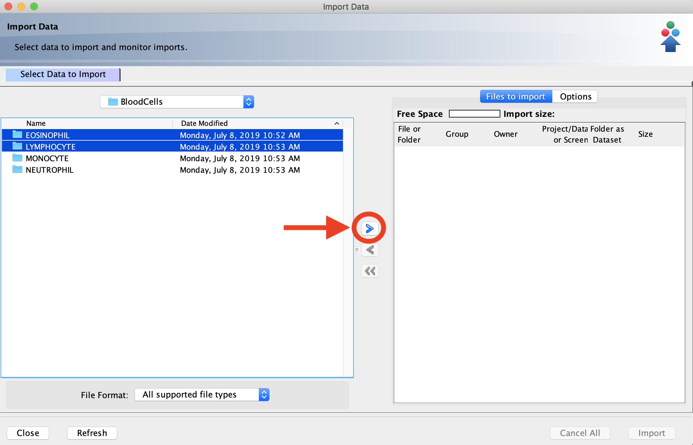

4. In the Import Location menu, you can choose a Project, Dataset, or Screen\* to import your
   images to, allowing you to organize your images before they are uploaded to the OMERO database.
   If your desired Project/Dataset/Screen doesn't exist yet, you can click the **New** button
   to create a new one.

    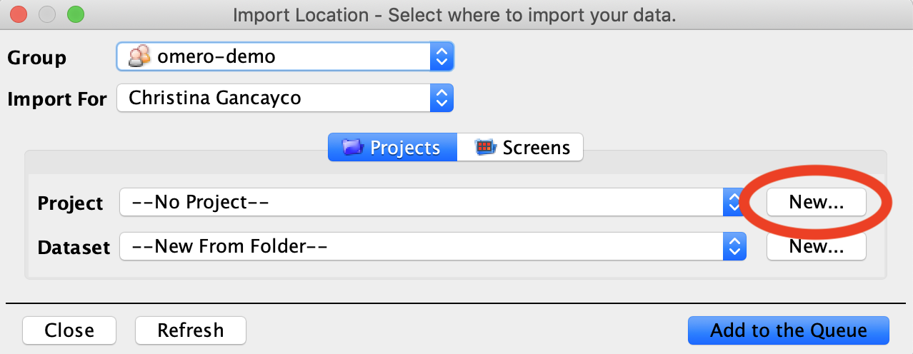

5. Once your data and locations are selected, click the **Add to the Queue** button. This
   will close the Import Location menu and return you to the Importer tool. Click the
   **Import** button in the bottom right corner of the Importer tool to begin uploading your images.

    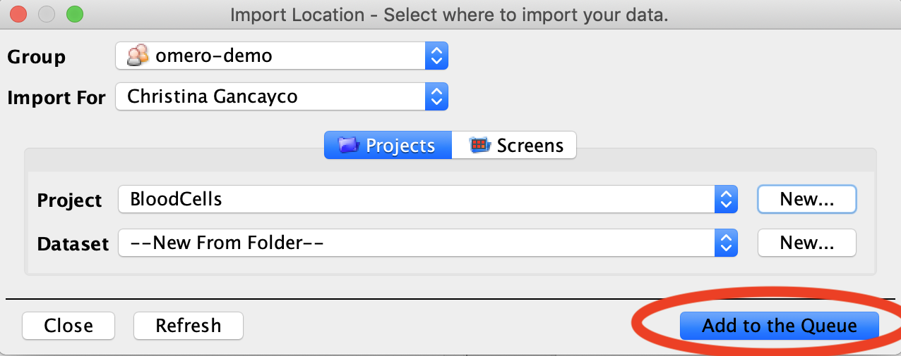

    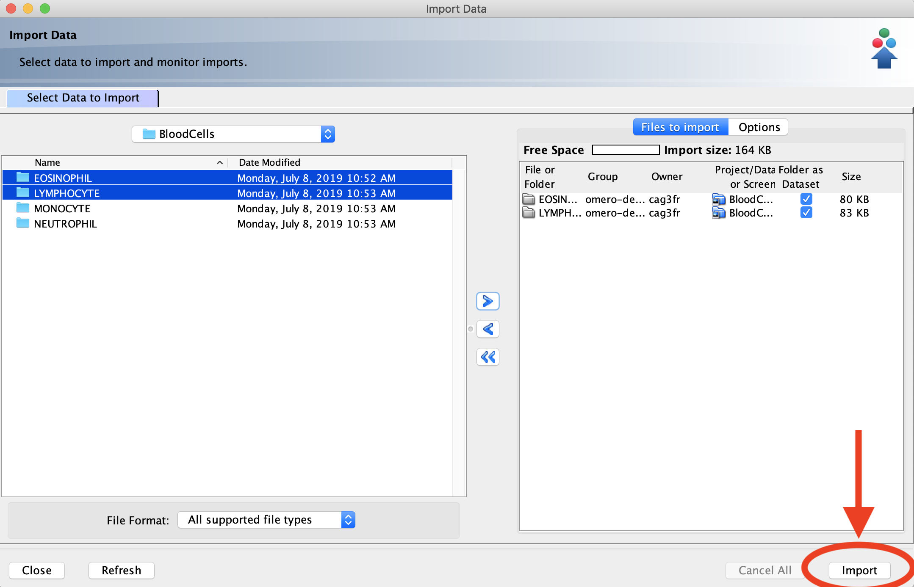

    You can monitor the progress of your import and begin viewing images in OMERO before the 
entire upload is complete.

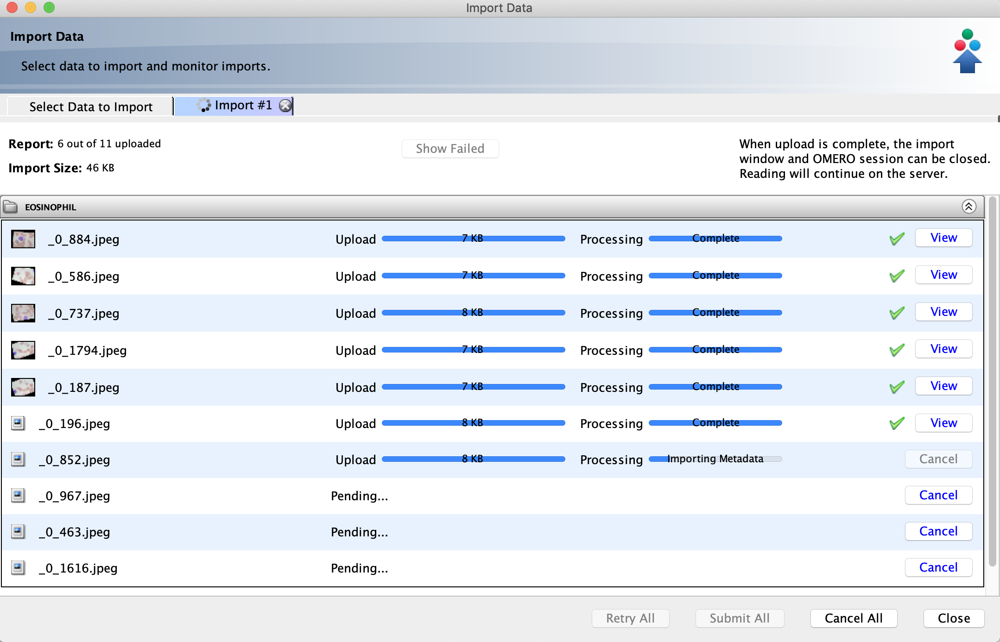

    Once imported, you will see any new Projects or Datasets you created in the left window pane. 
If you expand the Datasets, thumbnail versions of your images will appear in the center window
pane of the OMERO.insight app.

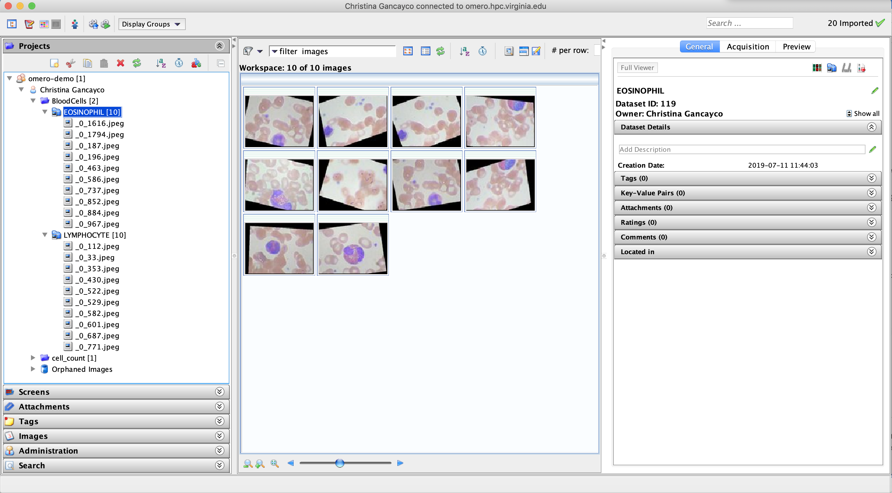


## Using the Command Line

You can also use OMERO.cli to import images.

To import an individual image:

```
omero import BloodCells/EOSINOPHIL/_0_1845.jpeg
```

To import all the EOSINOPHIL images:

```
omero import BloodCells/EOSINOPHIL
```

Note that when importing images through the Command Line, they are imported to the **Orphaned Images**
bin by default. To send them to a dataset, we can use **Targeted Imports**. If the Dataset doesn't exist
yet, then OMERO will create the new Dataset for you.

```
omero import BloodCells/EOSINOPHIL Dataset:name:EOSINOPHIL
```

**Research Computing can help you create scripts for bulk import of your data!**

# Organize Images

In OMERO, images can be organized using one of two different structures:

1. Project > Dataset
2. Screen > Plate > Well

Images can be organized using the first structure in either OMERO.insight or OMERO.web with drag-and-drop.
You can also organize images into **Projects > Datasets** using OMERO.cli tools or OMERO.py tools for Python.

Currently, images can only be organized into **Screen > Plate > Well** using OMERO.py.

## Project > Dataset

### Using OMERO.insight or OMERO.web

1. Create a new Project or Dataset by clicking the **New** icon in the top left-hand menu of the **Projects** tab.

    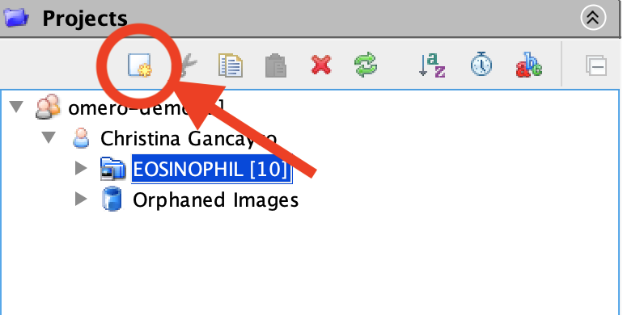

2. Type in a Project/Dataset title. Optionally, you can also add a description. Once complete, click the **Create** button.

    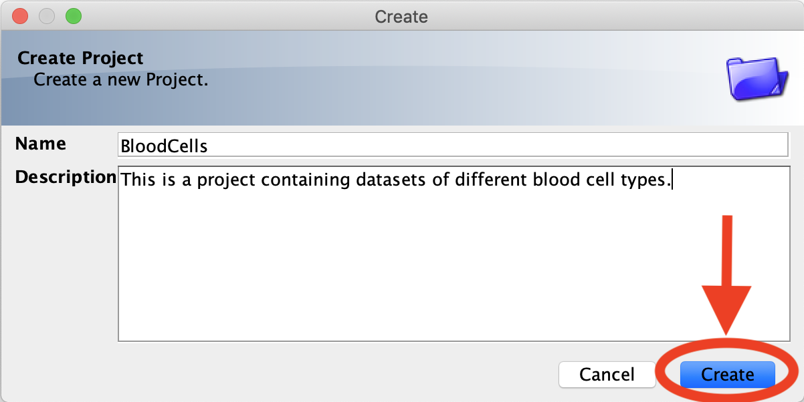

3. You can now click and drag a Dataset to the Project where you would like it to reside.


## Screen > Plate > Well

A simple Python and bash script can be used to import images using this structure.

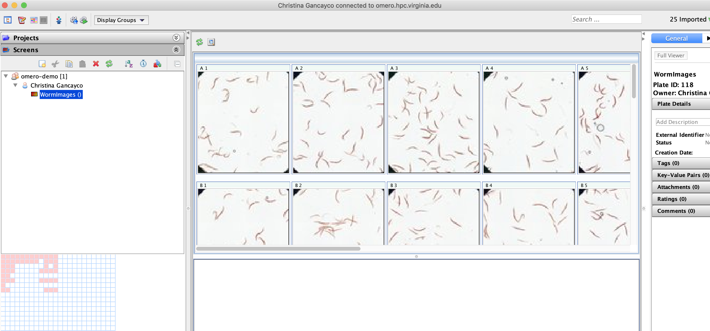

**Research Computing can help you create scripts for importing images as wells in a plate.**


# Tags

Tags are keywords that you can attach to images. You can filter images by a particular tag or
tags, allowing for easy targeted image retrieval.

## Adding Tags

1. Click the **New Tag** icon in the top left-hand menu of the **Tags** tab.

    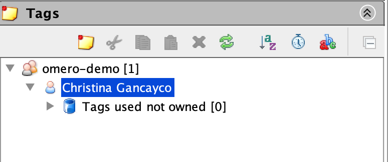

2. Type in a name for your tag (description optional). Click the **Create** button.

    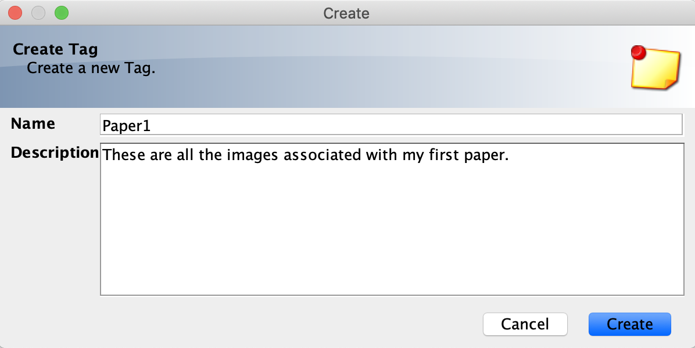

3. To add a tag to an image, first select the image. Then click the "+" sign under the **Tags** tab in the right-hand menu.

    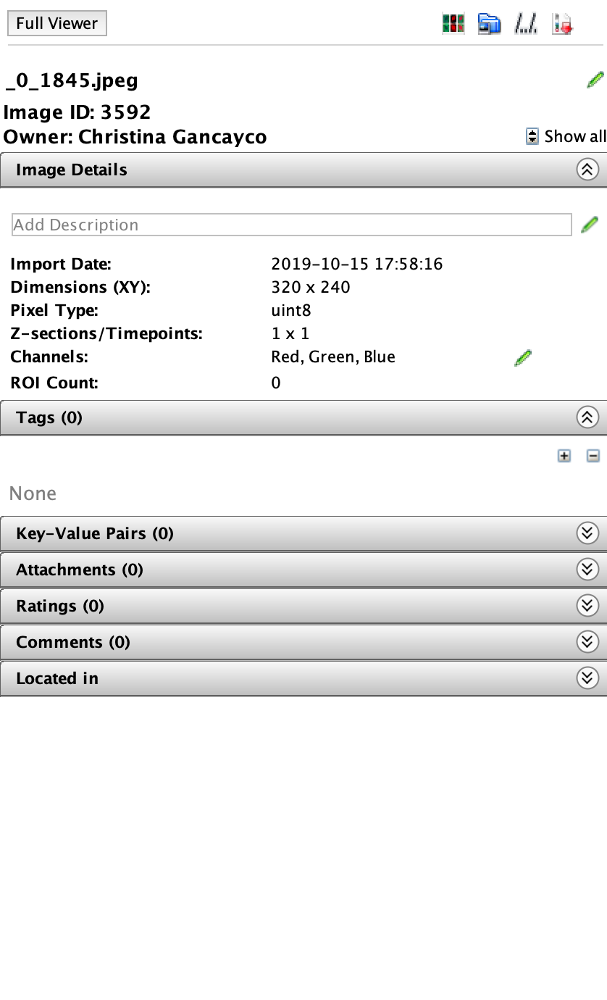

4. Select your desired tag(s) on the left-hand side of the **Tags Selection** menu and click the ">" arrow to add the tag. Click the **Save** button to save your added tags.

    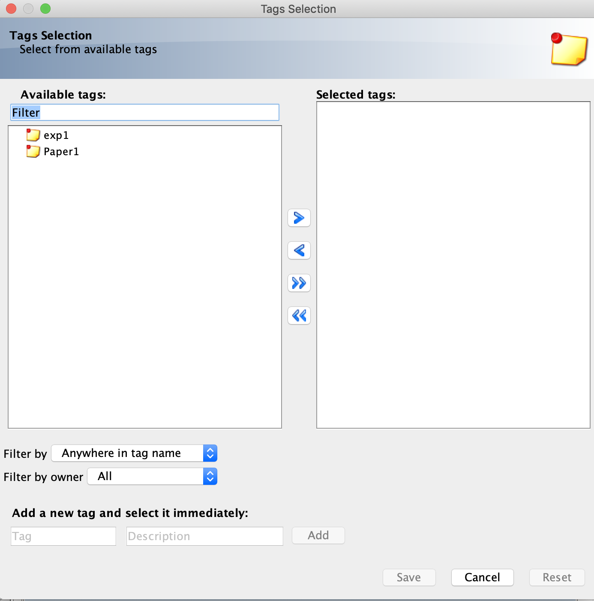


## Filtering by Tag

You can filter images by tag using one of two methods. Tagged images will appear in the center panel of the OMERO app.

1. Select the desired tag(s) from the **Tags** tab.
2. Enter your desired tag in the top **Search** bar.

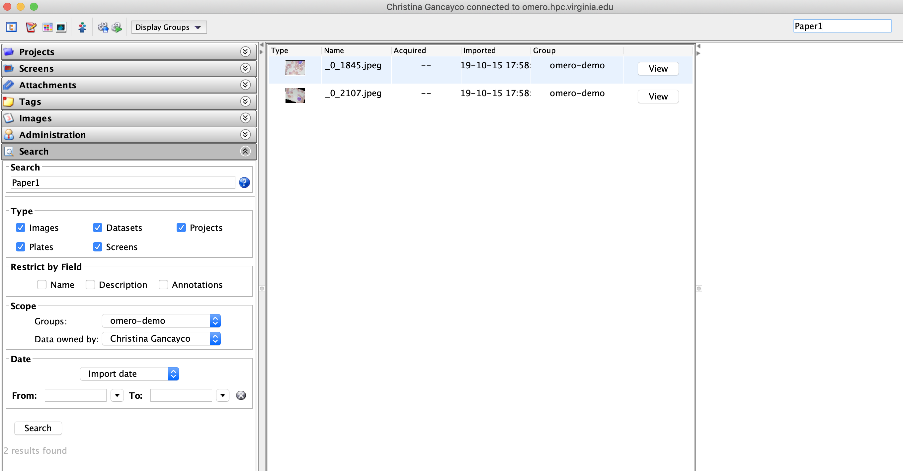

# Annotations

You can annotate images with comments that can then be viewed by collaborators. You can also
annotate images with customizable key-value pairs to attach further information to your data.

## Comments

1. To add a comment on a selected image, simply select an image/dataset/project and navigate to the **Comments** tab of the right-hand menu.
2. Type your comment into the empty text box.
3. Click the **Comment** button to add your comment.


## Key-Value Pairs

1. To add a Key-Value pair, select an image/dataset/project and navigate to the **Key-Value Pairs** tab in the right-hand menu.
2. Double-click a cell the left-hand side of the table to modify a key. Double-click the corresponding right-hand cell to modify its value. Click the green "+" to add another key-value pair.


# Third-Party Software

OMERO is compatible with a variety of third-party software packages that are commonly used
in image processing. The examples below show how you can use OMERO with Fiji and MATLAB.

## Fiji/ImageJ

Fiji/ImageJ is open-source software for scientific image processing. OMERO can be installed as a plugin for easy image import and export.

Examples of using OMERO with Fiji can be found in the online tutorial for [Image Processing with Fiji and Omero](/content/courses/fiji-image-processing/fiji-omero.md).


## MATLAB

OMERO can be used with MATLAB for image import and export, as well as for annotating images.

The following example script shows an example pipeline where:

1. Images are imported from OMERO to MATLAB
2. Image contrast is enhanced
3. Images are binarized
4. Cells are automatically counted
5. Binarized images are exported to OMERO with cell count annotated to the image
